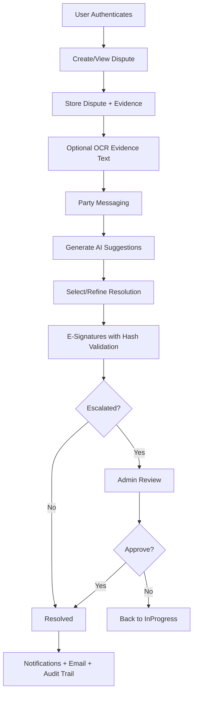

# 1. COVER PAGE

**Project Title:** AI Dispute Resolver  
**Team Members:**  
- Narendra Pandrangi (Primary Contributor inferred from repository history)  
- Copilot SWE Agent Bot (automation contributor)  
- *Additional team members: ____________________*  

**Organization / College:** *Not explicitly declared in repository (to be filled by submitting institution)*  
**Guide / Maintainer:** NarendraPandrangi (GitHub repository owner/maintainer)  
**Submission Date:** 18 March 2026

---

# 2. DECLARATION

I/We hereby declare that the project report titled **“AI Dispute Resolver”** is an original work prepared from the implementation and artifacts available in the repository `NarendraPandrangi/Major-Project`. This documentation has been prepared by studying the complete codebase, configuration files, technical guides, scripts, and supporting assets present in the repository at the time of submission.

All references to external frameworks, libraries, and services have been acknowledged in the References section. Any inferred architecture or behavior has been derived from source code and documented repository materials.

---

# 3. CERTIFICATE

This is to certify that the project documentation titled **“AI Dispute Resolver”** is a technically consolidated report based on the implementation available in the corresponding repository and has been prepared in a professional format suitable for academic/professional submission.

**Certified by:** ____________________  
**Designation:** ____________________  
**Institution/Organization:** ____________________  
**Date:** ____________________

---

# 4. ABSTRACT

The **AI Dispute Resolver** is a full-stack digital dispute management and resolution platform that combines secure authentication, structured dispute workflows, AI-generated settlement recommendations, evidence handling, email notifications, administrative moderation, and e-signature-based settlement finalization.

The system addresses delays and subjectivity in manual dispute handling by digitizing the end-to-end process: dispute filing, conversation capture, AI-assisted negotiation options, escalation to administrative review, and closure through approved resolution. The backend is implemented in **FastAPI (Python)** and uses a custom **Firestore REST client** for persistence. The frontend is implemented in **React + Vite**, with modular pages and components for users and administrators.

Key technology integrations include:
- **Machine intelligence:** Krutrim LLM API (`Krutrim-spectre-v2`) for generating structured settlement options.
- **Cloud identity:** Firebase/Google token verification and JWT-based API authorization.
- **Automation:** Email workflows (welcome, dispute updates, acceptance/rejection, admin decisions) via frontend EmailJS and backend SMTP support.
- **Evidence intelligence:** OCR extraction using **Tesseract.js** to convert uploaded evidence into analyzable text.
- **Digital acceptance:** Typed/drawn electronic signatures with agreement hash/version control and printable settlement artifacts.

The resulting platform provides a practical foundation for scalable online dispute resolution (ODR) with transparent state transitions, role-based access control, and a submission-ready architecture.

---

# 5. OBJECTIVE

The implemented objectives derived from repository logic are:

1. Build a secure multi-user dispute resolution system with role-based authorization.
2. Support dual authentication modes: email/password and Google/Firebase login.
3. Enable users to file disputes with structured metadata and optional evidence.
4. Extract useful evidence text automatically using OCR.
5. Provide AI-generated, context-aware settlement options from dispute and chat context.
6. Implement direct party communication through dispute-level messaging.
7. Support decision workflow operations: accept, reject, escalate, drop, approve, and reopen.
8. Add legally oriented e-signature collection tied to immutable agreement hashes.
9. Automate notifications and communication through in-app and email channels.
10. Provide an administrative dashboard for oversight, approval, and analytics.

---

# 6. TEAM DETAILS

## 6.1 Contributors (from repository history)
- **NarendraPandrangi** (`narendrapandrangi78@gmail.com`) – primary human contributor/maintainer.
- **copilot-swe-agent[bot]** (`198982749+Copilot@users.noreply.github.com`) – automation-assisted contributor.

## 6.2 Suggested Academic Team Detail Template
- Student 1: ____________________ (Roll No: ______)
- Student 2: ____________________ (Roll No: ______)
- Student 3: ____________________ (Roll No: ______)
- Department: ____________________
- Institution: ____________________

---

# 7. ACKNOWLEDGEMENT

This documentation acknowledges the open-source ecosystem and service providers used in this project: FastAPI, React, Firebase, Firestore, EmailJS, Tesseract.js, Axios, and related libraries. The project reflects iterative engineering captured through extensive repository documentation, implementation notes, and feature-specific change records.

Gratitude is extended to project maintainers, contributors, and reviewers whose implementation and documentation artifacts made this comprehensive technical synthesis possible.

---

# 8. PROJECT MAPPING WITH PO

| Project Outcome / Capability | Program Outcome (PO) Mapping | Repository Evidence |
|---|---|---|
| Full-stack web application architecture | PO1 (Engineering Knowledge), PO3 (Design/Development) | `backend/main.py`, `frontend/src/App.jsx`, router/page modules |
| Secure authentication and authorization | PO2 (Problem Analysis), PO8 (Ethics/Security) | `backend/auth.py`, `backend/routers/users.py`, `frontend/src/context/AuthContext.jsx` |
| AI-assisted decision support | PO4 (Investigations), PO5 (Modern Tool Usage) | `backend/routers/ai.py`, `frontend/src/pages/DisputeAISolutions.jsx` |
| Automated communication workflow | PO5, PO10 (Communication) | `backend/email_service.py`, `frontend/src/services/emailService.js` |
| Dispute lifecycle workflow engineering | PO3, PO11 (Project Management) | `backend/routers/disputes.py`, `backend/routers/admin.py` |
| Digital documentation and reporting readiness | PO10, PO12 (Lifelong Learning) | 40+ root documentation files and implementation summaries |

---

# 9. LIST OF FIGURES

1. **Figure 1:** High-Level System Block Diagram (Frontend, Backend, Firestore, External Services)  
2. **Figure 2:** End-to-End Dispute Process Flow  
3. **Figure 3:** Authentication and Authorization Flow  
4. **Figure 4:** AI Suggestion Generation Pipeline  
5. **Figure 5:** E-Signature and Resolution Finalization Flow  
6. **Figure 6:** Admin Approval Workflow  

---

# 10. LIST OF TABLES

1. **Table 1:** Technology Stack Summary  
2. **Table 2:** Backend API Route Inventory  
3. **Table 3:** Firestore Data Model/Collections  
4. **Table 4:** Frontend Module and Page Mapping  
5. **Table 5:** Environment Variables Matrix  
6. **Table 6:** Testing/Validation Outcomes  
7. **Table 7:** Repository File Coverage Matrix  

---

# CHAPTER 1: INTRODUCTION

## 1.1 Project Overview

The repository implements an **AI-enabled Online Dispute Resolution (ODR) platform** with a React frontend and FastAPI backend. The domain combines legal-tech workflow design with practical software modules for authentication, case filing, communication, AI-based recommendation, notifications, and administrative approval.

Core characteristics observed from implementation:
- Hybrid auth model (JWT + Firebase/Google).
- NoSQL data persistence through Firestore REST interactions.
- Multi-stage dispute state machine (Open → InProgress → PendingApproval → Resolved/Rejected/Dropped).
- Human-in-the-loop AI support rather than full autonomous judgment.
- Evidence workflow with optional OCR extraction.

## 1.2 Purpose

The system exists to reduce inefficiency in traditional dispute handling by:
- digitizing complaint intake,
- structuring bilateral communication,
- generating actionable settlement options through AI,
- and enabling verifiable digital closure through signatures and administrative governance.

## 1.3 Objective

### Technical Goals
- Deliver a modular, API-driven dispute platform.
- Provide secure, tokenized access control.
- Integrate external intelligence and communication services.
- Ensure frontend-backend parity for workflow states.

### Business/Operational Goals
- Reduce dispute turnaround time.
- Improve decision consistency.
- Preserve traceable dispute records and resolution artifacts.
- Enable scalable remote dispute resolution operations.

## 1.4 Literature Survey (Domain-Relevant)

The project aligns with current ODR and AI-assist practices:
1. **ODR Systems:** Modern systems emphasize digitized filing, communication logs, guided negotiation, and moderated finalization.
2. **AI in Legal/Dispute Workflows:** LLM-assisted recommendation is used for option generation, document summarization, and guided decisioning while retaining human oversight.
3. **Trust and Explainability:** Structured options and explicit analysis sections improve user trust in AI-generated outcomes.
4. **Digital Consent Mechanisms:** E-signature and version hashing patterns are commonly used to preserve agreement integrity.
5. **Cloud-native service patterns:** API-first backend, SPA frontend, and managed cloud data services are now standard for rapid deployment.

## 1.5 Requirement Specifications

### Hardware (Typical deployment/development)
- CPU: Multi-core processor (x86_64/ARM equivalent)
- RAM: 8 GB minimum (recommended 16 GB for local concurrent frontend/backend workflows)
- Storage: Sufficient for Node/Python dependencies and logs

### Software

**Backend:**
- Python 3.9+
- FastAPI, Uvicorn, Pydantic
- python-jose, python-dotenv, requests
- Firestore REST API access

**Frontend:**
- Node.js 18+
- React 18, Vite 5
- React Router 6, Axios, Lucide React
- Firebase SDK
- Tesseract.js (OCR)
- react-to-print

**External integrations:**
- Firebase Authentication / Google OAuth
- Krutrim Cloud LLM API
- EmailJS and/or SMTP mail provider

---

# CHAPTER 2: SYSTEM STUDY AND ANALYSIS

## 2.1 Existing System

Conventional dispute processes (email/phone/manual) typically suffer from:
- fragmented communication,
- lack of structured status transitions,
- low transparency in negotiation stages,
- poor auditability of final agreement terms,
- delayed decision support.

## 2.2 Proposed System

This repository proposes a unified platform with:
- centralized dispute records,
- role-aware dashboards,
- AI-assisted but human-supervised settlement options,
- notification and email automation,
- admin escalation/approval gates,
- and digital agreement capture.

## 2.3 Theoretical Background

### Authentication and Identity
- JWT secures API calls.
- Firebase/Google tokens are verified server-side and mapped to user records.

### Backend Service Pattern
- FastAPI routers segment business domains (`users`, `disputes`, `ai`, `admin`, etc.).
- Firestore client abstracts CRUD/query with conversion between Firestore field types and Python objects.

### Frontend SPA Pattern
- Route protection via context (`AuthContext`) and wrapper components.
- Axios interceptors enforce token injection and unauthorized session handling.

### AI-assisted Decision Support
- Prompt construction includes dispute metadata, evidence summary, and chat transcript.
- Output parsing normalizes options for frontend rendering.

### Digital Agreement Integrity
- Agreement content hash and version are computed and validated during signature submission.
- This prevents signing stale/modified content without user refresh.

## 2.4 Process Flow

1. User registers/logs in (email or Google).
2. User files dispute with structured fields and optional evidence upload.
3. OCR extracts text from evidence where possible.
4. Defendant views dispute and may accept/reject/respond.
5. Parties exchange messages in dispute thread.
6. AI module generates 3 contextual settlement options.
7. Parties negotiate/select terms; e-signatures collected per agreement version.
8. Escalated disputes enter admin queue.
9. Admin approves or rejects proposed resolution.
10. Notifications/emails are dispatched; records persist in Firestore.

---

# CHAPTER 3: SYSTEM DESIGN

## 3.1 Block Diagram

```mermaid
flowchart LR
    U[End Users / Admin] --> F[React Frontend (Vite)]
    F --> A[FastAPI Backend]
    A --> D[Firestore REST API]
    A --> K[Krutrim LLM API]
    F --> E[EmailJS]
    A --> S[SMTP Email Service]
    F --> O[Tesseract.js OCR]
    F --> G[Firebase Auth]
    A --> G
```

**Design Explanation:**
- UI and interaction live in React pages/components.
- Backend governs authorization, workflow state transitions, and integration orchestration.
- Firestore acts as source of truth for users, disputes, notifications, and messages.
- AI, auth, OCR, and email are integration modules around core workflow.

## 3.2 Process Flow Diagram



---

# CHAPTER 4: CODE MODULE

## 4.1 Dataset / Inputs

This project does not ship with a static ML training dataset. Instead, it operates on **runtime transactional inputs**:

1. **User Inputs:** registration data, login credentials, profile data.
2. **Dispute Inputs:** title, category, description, defendant email, optional evidence file.
3. **Message Inputs:** negotiation chat messages between parties.
4. **Evidence-Derived Input:** OCR-extracted text (`evidence_text`) using Tesseract.js.
5. **AI Context Inputs:** dispute details + evidence summary + chat transcript passed to Krutrim LLM.
6. **Admin Inputs:** approval decision (`approve`/`reject`) and optional notes.

## 4.2 Code Explanation

### 4.2.1 Backend Modules

- **`backend/main.py`**: FastAPI app initialization, CORS setup, router registration, health/root endpoints.
- **`backend/auth.py`**: PBKDF2 password hash/verify, JWT create/verify, current-user dependency, Google/Firebase token verification.
- **`backend/database.py`**: Custom Firestore REST wrappers (`CollectionReference`, `Query`, `DocumentReference`, `DocumentSnapshot`) and type conversion logic.
- **`backend/email_service.py`**: SMTP templates and mail dispatch for registration and dispute lifecycle events.
- **`backend/routers/users.py`**:
  - `/register`
  - `/login`
  - `/login/email`
  - `/google`
  - `/me`
- **`backend/routers/disputes.py`**:
  - create/list/get/update/delete disputes
  - accept/reject/escalate/drop actions
  - dispute messages endpoints
  - signing-info/sign endpoints with agreement hash/version checks
- **`backend/routers/ai.py`**: AI suggestion generation, prompt engineering, retry handling, parsing and persistence of analysis/options.
- **`backend/routers/admin.py`**: pending approvals, decision endpoint, dropped disputes, global stats, all disputes/users views.
- **`backend/routers/dashboard.py`**: personal dashboard statistics and recent disputes.
- **`backend/routers/notifications.py`**: list unread/all and mark read operations.
- **`backend/create_admin.py`**: CLI utility to assign/create admin accounts.
- **`backend/test_auth_flow.py`, `backend/test_ai_connection.py`, `backend/debug_login.py`**: manual/debug validation scripts.
- **`backend/models.py` + `backend/schemas.py`**: data model enums/schemas (includes some legacy SQLAlchemy patterns while Firestore is active persistence).

### 4.2.2 Frontend Modules

- **`frontend/src/main.jsx`**: React mount/bootstrap.
- **`frontend/src/App.jsx`**: route definitions and route guards (public/protected wrappers).
- **`frontend/src/context/AuthContext.jsx`**: auth session state; login/register/google/password reset/logout helpers.
- **`frontend/src/api/client.js`**: centralized Axios client and API namespaces (`authAPI`, `disputesAPI`, `dashboardAPI`, `notificationsAPI`, `aiAPI`, `adminAPI`).
- **Authentication/UI pages**: `Login.jsx`, `Register.jsx`, `Home.jsx`, with associated CSS.
- **User workflow pages**: `Dashboard.jsx`, `DisputeForm.jsx`, `DisputeList.jsx`, `DisputeDetails.jsx`, `DisputeAISolutions.jsx`, `DisputeChatPage.jsx`.
- **Admin workflow page**: `AdminPanel.jsx`.
- **Reusable components**: `Chat.jsx`, `DisputeSidebar.jsx`, `ESignatureModal.jsx`, `SettlementAgreement.jsx`.
- **Integration utilities**:
  - `firebase/config.js` (Firebase init and auth SDK exports)
  - `services/emailService.js` + `utils/emailService.js` (EmailJS workflows)
  - `emailConfigValidator.js` (startup config checks)

### 4.2.3 API Route Inventory

| Router | Endpoint | Purpose |
|---|---|---|
| users | `POST /api/auth/register` | register local user |
| users | `POST /api/auth/login` | OAuth2 form login |
| users | `POST /api/auth/login/email` | JSON login |
| users | `POST /api/auth/google` | Google/Firebase login |
| users | `GET /api/auth/me` | current user |
| disputes | `POST /api/disputes/` | create dispute |
| disputes | `GET /api/disputes/` | list related disputes |
| disputes | `GET /api/disputes/filed` | disputes filed by user |
| disputes | `GET /api/disputes/against` | disputes against user |
| disputes | `GET /api/disputes/{id}` | get dispute |
| disputes | `PUT /api/disputes/{id}/status` | update status |
| disputes | `DELETE /api/disputes/{id}` | delete by owner |
| disputes | `POST /api/disputes/{id}/accept` | defendant accept |
| disputes | `POST /api/disputes/{id}/reject` | defendant reject |
| disputes | `POST /api/disputes/{id}/escalate` | escalate to admin |
| disputes | `POST /api/disputes/{id}/drop` | plaintiff drop |
| disputes | `GET /api/disputes/{id}/signing-info` | agreement metadata |
| disputes | `POST /api/disputes/{id}/sign` | record e-signature |
| disputes | `POST /api/disputes/{id}/messages` | send message |
| disputes | `GET /api/disputes/{id}/messages` | get messages |
| dashboard | `GET /api/dashboard/stats` | user dashboard stats |
| notifications | `GET /api/notifications/` | all notifications |
| notifications | `GET /api/notifications/unread` | unread notifications |
| notifications | `PUT /api/notifications/{id}/read` | mark one read |
| notifications | `PUT /api/notifications/read-all` | mark all read |
| ai | `POST /api/ai/suggestions` | generate/retrieve AI suggestions |
| admin | `GET /api/admin/pending-approvals` | pending resolution queue |
| admin | `POST /api/admin/{id}/approve-resolution` | approve/reject resolution |
| admin | `GET /api/admin/dropped-disputes` | dropped disputes |
| admin | `GET /api/admin/stats` | admin metrics |
| admin | `GET /api/admin/all-disputes` | all disputes |
| admin | `GET /api/admin/all-users` | all users (safe fields) |

### 4.2.4 Firestore Schema

| Collection | Key Fields | Notes |
|---|---|---|
| `users` | email, username, hashed_password, role, auth_provider, google_id, is_active, is_verified | user identity and role |
| `disputes` | title, category, description, user_id, defendant_email, status, ai_analysis, ai_suggestions, signatures | core case records |
| `notifications` | user_id, type, title, message, is_read, link | user notification feed |
| `disputes/{id}/messages` | sender, content, created_at | negotiation transcript |
| `chats` | optional/legacy | declared but less central |

### 4.2.5 Environment and Configuration Matrix

| File | Purpose |
|---|---|
| `backend/.env.example` | Firebase/JWT/SMTP/Google client settings template |
| `frontend/.env.example` | API URL + EmailJS template/service keys |
| `frontend/vite.config.js` | dev proxy, dev port, manual chunk splitting |
| `frontend/vercel.json` | SPA rewrite for deployment |
| `setup.ps1` | automated Windows setup bootstrap script |
| `.gitignore` | ignores secrets, build artifacts, caches |

### 4.2.6 Repository File Coverage Matrix (all non-generated tracked files)

> Generated/runtime outputs (`node_modules`, `dist`, `__pycache__`) are intentionally excluded from permanent architecture scope.

#### Root and Documentation Files
- `.gitignore`
- `README.md`
- `README_FINAL.md`
- `ARCHITECTURE.md`
- `QUICKSTART.md`
- `GET_STARTED.md`
- `QUICK_REFERENCE.md`
- `COMMANDS.md`
- `TESTING_GUIDE.md`
- `IMPLEMENTATION_SUMMARY.md`
- `CHANGELOG_ADMIN_PANEL.md`
- `AI_Dispute_Resolver_Full_Project_Content.pdf`
- `ADMIN_PANEL_DOCUMENTATION.md`
- `ADMIN_PANEL_SUMMARY.md`
- `ADMIN_WORKFLOW_DIAGRAM.md`
- `CREATE_ADMIN_USER.md`
- `ACCEPT_BUTTON_IMPLEMENTATION.md`
- `ACCEPT_BUTTONS_CONFIRMED.md`
- `ACCEPT_BUTTONS_FINAL_FIX.md`
- `ACCEPT_BUTTONS_FINAL_SUMMARY.md`
- `ACCEPT_REJECT_EMAILS.md`
- `AI_SOLUTION_ACCEPTANCE_GUIDE.md`
- `AI_SUGGESTIONS_FIX.md`
- `AI_SUGGESTIONS_VISUAL_ENHANCEMENT.md`
- `EMAILJS_SETUP.md`
- `EMAILJS_QUICK_SETUP.md`
- `EMAILJS_TEMPLATE_FIX.md`
- `EMAIL_SETUP.md`
- `EMAIL_SETUP_GUIDE.md`
- `EMAIL_SETUP_STATUS.md`
- `EMAIL_SERVICE_GUIDE.md`
- `EMAIL_ARCHITECTURE.md`
- `CREATE_EMAIL_TEMPLATES.md`
- `DISPUTE_EMAIL_TEMPLATE.md`
- `ALL_DISPUTE_EMAIL_TEMPLATES.md`
- `WELCOME_EMAIL_TEMPLATE.md`
- `WELCOME_EMAIL_CONFIGURED.md`
- `WELCOME_EMAIL_DEBUG.md`
- `WELCOME_EMAIL_SUCCESS.md`
- `REGISTRATION_EMAIL_FIX.md`
- `GOOGLE_SIGNIN_FIX.md`
- `GOOGLE_SIGNIN_FIXED.md`
- `FIRESTORE_MIGRATION.md`
- `FIRESTORE_REST_API.md`
- `DISK_SPACE_FIX.md`
- `setup.ps1`

#### Backend Files
- `backend/.env.example`
- `backend/requirements.txt`
- `backend/main.py`
- `backend/database.py`
- `backend/models.py`
- `backend/schemas.py`
- `backend/auth.py`
- `backend/create_admin.py`
- `backend/email_service.py`
- `backend/debug_login.py`
- `backend/test_auth_flow.py`
- `backend/test_ai_connection.py`
- `backend/routers/__init__.py`
- `backend/routers/users.py`
- `backend/routers/disputes.py`
- `backend/routers/dashboard.py`
- `backend/routers/admin.py`
- `backend/routers/ai.py`
- `backend/routers/notifications.py`

#### Frontend Files
- `frontend/.env.example`
- `frontend/package.json`
- `frontend/package-lock.json`
- `frontend/index.html`
- `frontend/vite.config.js`
- `frontend/vercel.json`
- `frontend/src/main.jsx`
- `frontend/src/App.jsx`
- `frontend/src/index.css`
- `frontend/src/emailConfigValidator.js`
- `frontend/src/api/client.js`
- `frontend/src/context/AuthContext.jsx`
- `frontend/src/firebase/config.js`
- `frontend/src/services/emailService.js`
- `frontend/src/utils/emailService.js`
- `frontend/src/components/Chat.jsx`
- `frontend/src/components/Chat.css`
- `frontend/src/components/DisputeSidebar.jsx`
- `frontend/src/components/ESignatureModal.jsx`
- `frontend/src/components/SettlementAgreement.jsx`
- `frontend/src/pages/Home.jsx`
- `frontend/src/pages/Home.css`
- `frontend/src/pages/Login.jsx`
- `frontend/src/pages/Register.jsx`
- `frontend/src/pages/Auth.css`
- `frontend/src/pages/Dashboard.jsx`
- `frontend/src/pages/Dashboard.css`
- `frontend/src/pages/DisputeList.jsx`
- `frontend/src/pages/DisputeForm.jsx`
- `frontend/src/pages/DisputeForm.css`
- `frontend/src/pages/DisputeDetails.jsx`
- `frontend/src/pages/DisputeDetails.css`
- `frontend/src/pages/DisputeChatPage.jsx`
- `frontend/src/pages/DisputeAISolutions.jsx`
- `frontend/src/pages/AdminPanel.jsx`
- `frontend/src/pages/AdminPanel.css`

---

# CHAPTER 5: TESTING

## 5.1 Testing Methods

### Existing Testing Style in Repository
- **Manual/Debug Script Testing (Backend):**
  - `test_auth_flow.py` for registration/login path checking.
  - `test_ai_connection.py` for Krutrim API connectivity validation.
  - `debug_login.py` for interactive troubleshooting.
- **Build Validation (Frontend):**
  - `npm run build` used as compile-time and bundling integrity check.
- **Code-level smoke validation (Backend):**
  - Python compile pass across backend modules.

### Baseline Validation Executed During Documentation Task
- Backend dependencies installed from `backend/requirements.txt`.
- `python -m compileall backend` completed successfully.
- Frontend dependencies installed using `npm ci`.
- `npm run build` completed successfully and produced production bundle.

## 5.2 Outputs

### Observed Build/Validation Output Highlights
- Frontend Vite build: successful bundle generation with chunked JS/CSS assets.
- Backend compile: all backend modules including routers compiled without syntax failures.

### Functional Output Surfaces (from implementation)
- User-facing pages for auth, dashboard, dispute filing/listing/details, AI solutions, and admin controls.
- API docs available through FastAPI when server runs (`/docs`).
- Email and notification outputs on major dispute state transitions.

## 5.3 Model Results (AI Module)

The repository does not contain offline benchmark datasets or numeric model evaluation metrics (e.g., accuracy/F1). Instead, AI output quality is operationally assessed via:
- generated analysis text,
- generation of exactly three settlement options,
- contextual relevance to dispute description and chat,
- storage/retrieval consistency (`force` vs cached behavior).

Thus, model evaluation in this project is **workflow-quality based** rather than dataset-benchmark based.

---

# CHAPTER 6: CONCLUSION

## 6.1 Conclusion

The repository demonstrates a mature applied software project that integrates web engineering, cloud services, and AI assistance to solve real-world dispute handling challenges. It successfully implements:
- secure identity flows,
- structured dispute lifecycle management,
- context-driven AI settlement generation,
- legally oriented digital agreement capture,
- role-based administrative controls,
- and broad operational documentation.

In practical terms, the system achieves a functioning digital ODR pipeline from dispute filing through negotiated or administratively approved closure.

## 6.2 Future Work

1. Add formal automated test suites (unit/integration/E2E) and CI quality gates.
2. Introduce real-time messaging/updates (WebSocket or Firestore listeners).
3. Implement stronger production security posture (httpOnly session options, stricter secret handling patterns).
4. Add richer analytics (resolution time, acceptance rates, AI option selection trends).
5. Support multi-language dispute handling and OCR pipelines.
6. Add legal-policy templating and region-specific compliance modules.
7. Improve AI observability with prompt/version tracking and reviewer feedback loops.

---

# CHAPTER 7: REFERENCES

## 7.1 Frameworks and Libraries
1. FastAPI Documentation — https://fastapi.tiangolo.com/
2. React Documentation — https://react.dev/
3. Vite Documentation — https://vitejs.dev/
4. Firebase Docs — https://firebase.google.com/docs
5. Firestore REST API — https://firebase.google.com/docs/firestore/use-rest-api
6. Axios Documentation — https://axios-http.com/
7. Tesseract.js — https://github.com/naptha/tesseract.js
8. react-to-print — https://github.com/gregnb/react-to-print
9. python-jose — https://github.com/mpdavis/python-jose
10. Pydantic — https://docs.pydantic.dev/

## 7.2 External Services
1. Krutrim Cloud API (`Krutrim-spectre-v2`) — service usage inferred from backend AI router.
2. EmailJS — https://www.emailjs.com/
3. Google OAuth / Firebase Auth infrastructure.

## 7.3 Repository Internal Technical References
1. `README.md`, `ARCHITECTURE.md`, `IMPLEMENTATION_SUMMARY.md`
2. Feature-specific docs (`ADMIN_*`, `EMAIL_*`, `AI_*`, `FIRESTORE_*`, `ACCEPT_*`)
3. Source modules in `backend/` and `frontend/src/`

---

## APPENDIX A: TABLE 1 — TECHNOLOGY STACK SUMMARY

| Layer | Technology |
|---|---|
| Frontend | React 18, Vite 5, React Router 6, Axios, Lucide React |
| Backend | FastAPI, Uvicorn, Pydantic, python-jose |
| Data | Firestore (REST API) |
| Auth | JWT + Firebase/Google OAuth |
| AI | Krutrim API (`Krutrim-spectre-v2`) |
| Email | EmailJS (frontend) + SMTP (backend support) |
| OCR | Tesseract.js |
| Printing | react-to-print |
| Deployment | Vercel config for SPA frontend |

## APPENDIX B: TABLE 5 — ENVIRONMENT VARIABLES MATRIX

| Variable | Scope | Purpose |
|---|---|---|
| `FIREBASE_PROJECT_ID` | Backend | Firestore/Firebase project reference |
| `FIREBASE_API_KEY` | Backend | Firestore REST access key |
| `SECRET_KEY` | Backend | JWT signing secret |
| `ALGORITHM` | Backend | JWT algorithm (HS256) |
| `ACCESS_TOKEN_EXPIRE_MINUTES` | Backend | token lifetime |
| `GOOGLE_CLIENT_ID` | Backend | Google OAuth audience validation |
| `SMTP_SERVER` | Backend | outgoing SMTP host |
| `SMTP_PORT` | Backend | outgoing SMTP port |
| `SENDER_EMAIL` | Backend | sender identity |
| `SENDER_PASSWORD` | Backend | sender credential/app password |
| `KUTRIM_API_KEY` | Backend | AI API authorization |
| `VITE_API_URL` | Frontend | backend base URL |
| `VITE_EMAILJS_*` | Frontend | EmailJS service/template/public key set |

